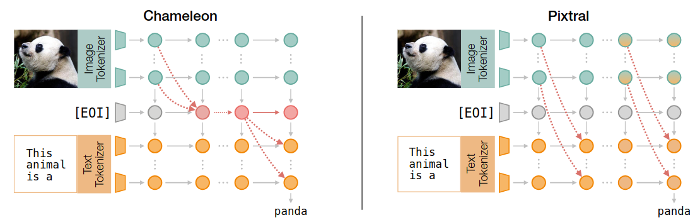

# The Narrow Gate: Localized Image-Text Communication in Vision-Language Models



This repo contains the code for replicating the experiment of the paper ***The Narrow Gate: Localized Image-Text Communication in Vision-Language Models***. 


## Setup
First, install the required packages:
```bash
git submodule update --init --recursive
poetry install
cd transformers
poetry install
```

## Reproducing the figures
The scripts for reproducing the figures are in the `paper_experiments` directory. The following will reproduce the results for the model facebook/chameleon-7b
```bash
cd paper_experiments
python Fig2_CosSim_Hom.py -m facebook/chameleon-7b -o .data/fig2
python Fig3_CrossAttention.py -m facebook/chameleon-7b -o .data/fig3
python Fig4_OverlapImagenet.py -m facebook/chameleon-7b -o .data/fig4
python Tab1_AblationCaptioning.py -m facebook/chameleon-7b -n 2000 -d coco -o .data/captioning
python Tab1_AblationCaptioning.py -m facebook/chameleon-7b -n 2000 -d flickr -o .data/captioning
python Tab1_AblationVQA.py -m facebook/chameleon-7b -n 2000 -o .data/captioning_vqa -md zero-shot
python Fig5_ActivationPatching.py -m facebook/chameleon-7b -o .data/patching
```
Please refer to the source of each script for the specific arguments.


